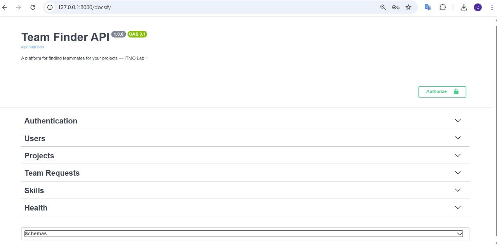
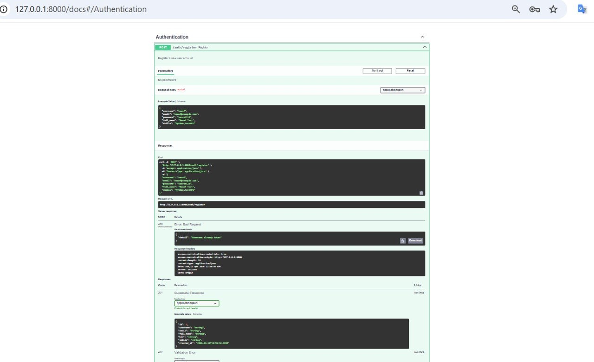
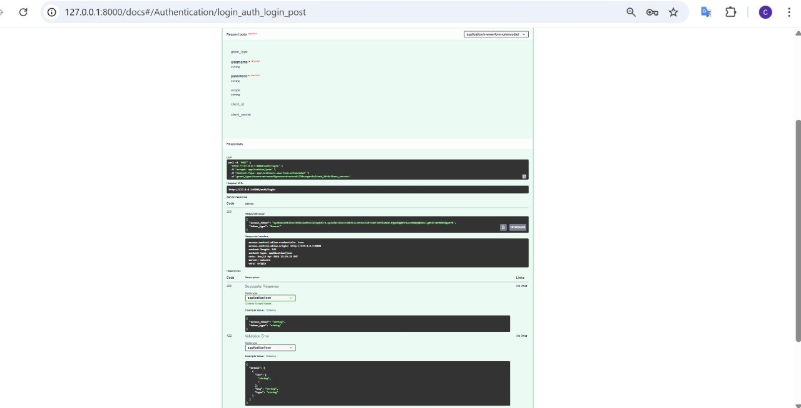
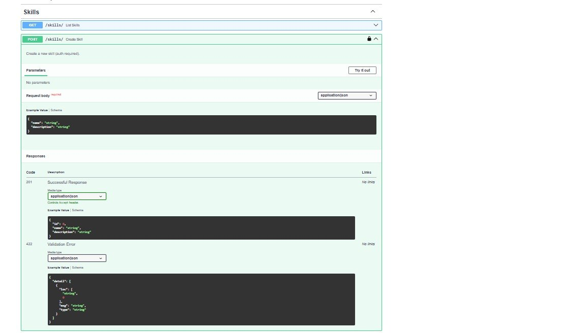
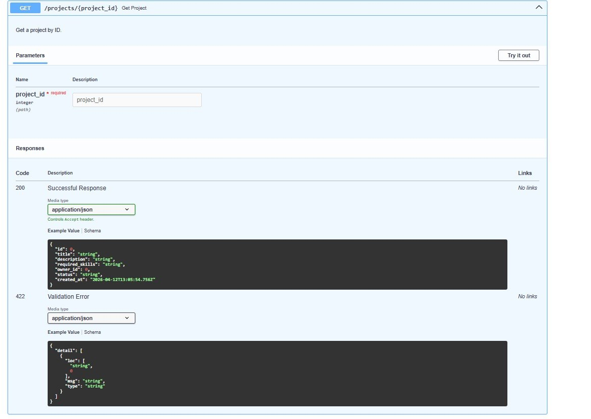
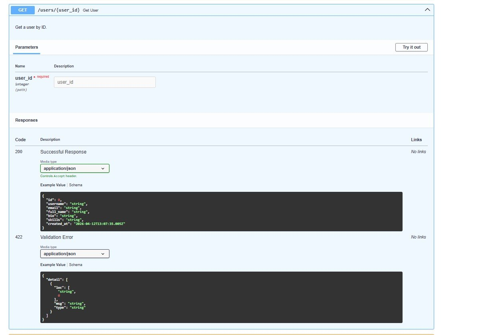

# Лабораторная работа 1
# Реализация серверного приложения FastAPI
## Тема: Разработка платформы для поиска людей в команду

GitHub Repository: [https://github.com/NNaafff1/ITMO_ICT_WebDevelopment_tools_2025-2026](https://github.com/NNaafff1/ITMO_ICT_WebDevelopment_tools_2025-2026)

Дата: Апрель 2026

---

## 1. Цель работы

Разработать полноценное серверное REST API приложение на основе фреймворка FastAPI для платформы поиска участников в проектные команды. Применить современные инструменты Python-разработки: ORM SQLAlchemy, JWT-аутентификация, Pydantic v2, Alembic для миграций базы данных, PostgreSQL.

## 2. Задание

Реализовать серверное приложение FastAPI для платформы поиска людей в команду. Приложение должно поддерживать: управление пользователями, создание проектов, отправку заявок на участие в проекте, систему аутентификации, управление навыками пользователей.

## 3. Описание предметной области

Платформа для поиска людей в команду (Team Finder) представляет собой веб-сервис, предназначенный для объединения специалистов различных направлений в проектные команды. В современном мире IT-индустрии и стартап-экосистемы зачастую возникает потребность в быстром формировании команд для реализации проектов — будь то хакатоны, учебные проекты, стартапы или фриланс-заказы.

Целевая аудитория платформы включает разработчиков, дизайнеров, аналитиков, менеджеров проектов и других специалистов, которые ищут единомышленников для совместной работы. Каждый пользователь создает профиль с указанием своих навыков и компетенций. Владельцы проектов публикуют описания своих идей с указанием необходимых навыков для участников команды.

Ключевой функционал платформы — система заявок на участие. Любой пользователь может отправить заявку на вступление в интересующий его проект. Владелец проекта рассматривает входящие заявки и принимает решение о включении кандидата в команду. Это обеспечивает контролируемый и прозрачный процесс формирования команд, где обе стороны имеют возможность оценить совместимость до начала совместной работы.

Платформа также реализует систему навыков через связь «многие-ко-многим» между пользователями и навыками, с возможностью указания уровня владения каждым навыком. Это позволяет владельцам проектов более точно подбирать кандидатов на основе их компетенций.

## 4. Описание моделей данных

### 4.1 User (Пользователь)

| Поле | Тип | Описание |
|------|-----|----------|
| id | Integer, PK | Уникальный идентификатор пользователя |
| username | String(50), unique | Имя пользователя для входа |
| email | String(100), unique | Электронная почта |
| hashed_password | String | Хэш пароля (bcrypt) |
| full_name | String(100) | Полное имя пользователя |
| bio | String(500), nullable | Краткая биография |
| skills | String(300), nullable | Навыки через запятую |
| created_at | DateTime | Дата регистрации |

### 4.2 Project (Проект)

| Поле | Тип | Описание |
|------|-----|----------|
| id | Integer, PK | Уникальный идентификатор проекта |
| title | String(200) | Название проекта |
| description | String(1000) | Описание проекта |
| required_skills | String(300), nullable | Требуемые навыки |
| owner_id | Integer, FK -> users.id | ID владельца проекта |
| status | String(20), default="open" | Статус проекта (open/closed) |
| created_at | DateTime | Дата создания |

### 4.3 TeamRequest (Заявка в команду)

| Поле | Тип | Описание |
|------|-----|----------|
| id | Integer, PK | Уникальный идентификатор заявки |
| project_id | Integer, FK -> projects.id | ID проекта |
| sender_id | Integer, FK -> users.id | ID отправителя заявки |
| status | String(20), default="pending" | Статус: pending/accepted/rejected |
| message | String(500), nullable | Сопроводительное сообщение |
| created_at | DateTime | Дата отправки заявки |

### 4.4 ProjectMember (Участник проекта)
| Поле | Тип | Описание |
|------|-----|----------|
| id | Integer, PK | Уникальный идентификатор записи |
| project_id | Integer, FK -> projects.id | ID проекта |
| user_id | Integer, FK -> users.id | ID участника |
| role | String(100), default="member" | Роль в проекте |
| joined_at | DateTime | Дата вступления |

### 4.5 Skill (Навык)

| Поле | Тип | Описание |
|------|-----|----------|
| id | Integer, PK | Уникальный идентификатор навыка |
| name | String(100), unique | Название навыка |
| description | String(300), nullable | Описание навыка |

### 4.6 UserSkill (Навыки пользователя — ассоциативная таблица)

| Поле | Тип | Описание |
|------|-----|----------|
| id | Integer, PK | Уникальный идентификатор записи |
| user_id | Integer, FK -> users.id | ID пользователя |
| skill_id | Integer, FK -> skills.id | ID навыка |
| level | String(50), default="beginner" | Уровень владения навыком |

### 4.7 Связи между моделями

- User -> Project: один-ко-многим. Пользователь может быть владельцем нескольких проектов. Связь реализована через поле owner_id в таблице projects с каскадным удалением.
- User -> TeamRequest: один-ко-многим. Пользователь может отправить несколько заявок в разные проекты. Связь через поле sender_id.
- Project -> TeamRequest: один-ко-многим. На каждый проект может поступить несколько заявок. Связь через поле project_id с каскадным удалением.
- User -> ProjectMember: один-ко-многим. Пользователь может быть участником нескольких проектов.
- Project -> ProjectMember: один-ко-многим. В проекте может быть несколько участников.
- User <-> Skill: многие-ко-многим через ассоциативную таблицу user_skills. Дополнительное поле level характеризует уровень владения навыком (beginner, intermediate, advanced).

## 5. Описание API эндпоинтов

### Аутентификация

| Метод | URL | Описание | Auth |
|-------|-----|----------|------|
| POST | /auth/register | Регистрация нового пользователя | Нет |
| POST | /auth/login | Вход, получение JWT токена | Нет |
| GET | /auth/me | Профиль текущего пользователя | Да |

### Пользователи

| Метод | URL | Описание | Auth |
|-------|-----|----------|------|
| GET | /users/ | Список всех пользователей (фильтр по навыку ?skill=) | Нет |
| GET | /users/{user_id} | Получение пользователя по ID | Нет |
| PUT | /users/{user_id} | Обновление профиля (только владелец) | Да |
| DELETE | /users/{user_id} | Удаление аккаунта (только владелец) | Да |

### Проекты

| Метод | URL | Описание | Auth |
|-------|-----|----------|------|
| POST | /projects/ | Создание нового проекта | Да |
| GET | /projects/ | Список проектов (фильтр по статусу ?status=) | Нет |
| GET | /projects/{project_id} | Получение проекта по ID | Нет |
| PUT | /projects/{project_id} | Обновление проекта (только владелец) | Да |
| DELETE | /projects/{project_id} | Удаление проекта (только владелец) | Да |
| GET | /projects/{project_id}/members | Список участников проекта | Нет |

### Заявки в команду

| Метод | URL | Описание | Auth |
|-------|-----|----------|------|
| POST | /team-requests/ | Отправка заявки на вступление в проект | Да |
| GET | /team-requests/my | Мои отправленные заявки | Да |
| GET | /team-requests/incoming | Входящие заявки на мои проекты | Да |
| PUT | /team-requests/{id}/accept | Принятие заявки (владелец проекта) | Да |
| PUT | /team-requests/{id}/reject | Отклонение заявки (владелец проекта) | Да |

### Навыки

| Метод | URL | Описание | Auth |
|-------|-----|----------|------|
| POST | /skills/ | Создание нового навыка | Да |
| GET | /skills/ | Список всех навыков | Нет |
| POST | /users/{user_id}/skills | Добавление навыка пользователю | Да |
| GET | /users/{user_id}/skills | Навыки пользователя | Нет |

### Скриншоты API

## 11. Код реализации

### 11.1 Подключение к базе данных
from sqlalchemy import create_engine
from sqlalchemy.orm import declarative_base, sessionmaker
from src.config import settings

engine = create_engine(settings.DATABASE_URL)
SessionLocal = sessionmaker(autocommit=False, autoflush=False, bind=engine)
Base = declarative_base()

def get_db():
    db = SessionLocal()
    try:
        yield db
    finally:
        db.close()

### 11.2 Модели базы данных

from datetime import datetime
from sqlalchemy import Column, Integer, String, DateTime, ForeignKey
from sqlalchemy.orm import relationship
from src.database import Base

class User(Base):
    __tablename__ = "users"

    id = Column(Integer, primary_key=True, autoincrement=True, index=True)
    username = Column(String(50), unique=True, nullable=False, index=True)
    email = Column(String(100), unique=True, nullable=False)
    hashed_password = Column(String, nullable=False)
    full_name = Column(String(100), nullable=False)
    bio = Column(String(500), nullable=True)
    skills = Column(String(300), nullable=True)
    created_at = Column(DateTime, default=datetime.utcnow)

    projects = relationship("Project", back_populates="owner", cascade="all, delete-orphan")
    sent_requests = relationship("TeamRequest", back_populates="sender", cascade="all, delete-orphan")
    memberships = relationship("ProjectMember", back_populates="user", cascade="all, delete-orphan")
    user_skills = relationship("UserSkill", back_populates="user", cascade="all, delete-orphan")

class Project(Base):
    __tablename__ = "projects"

    id = Column(Integer, primary_key=True, autoincrement=True, index=True)
    title = Column(String(200), nullable=False)
    description = Column(String(1000), nullable=False)
    required_skills = Column(String(300), nullable=True)
    owner_id = Column(Integer, ForeignKey("users.id"), nullable=False)
    status = Column(String(20), default="open")
    created_at = Column(DateTime, default=datetime.utcnow)

    owner = relationship("User", back_populates="projects")
    team_requests = relationship("TeamRequest", back_populates="project", cascade="all, delete-orphan")
    members = relationship("ProjectMember", back_populates="project", cascade="all, delete-orphan")

class TeamRequest(Base):
    __tablename__ = "team_requests"

    id = Column(Integer, primary_key=True, autoincrement=True)
    project_id = Column(Integer, ForeignKey("projects.id"), nullable=False)
    sender_id = Column(Integer, ForeignKey("users.id"), nullable=False)
    status = Column(String(20), default="pending")
    message = Column(String(500), nullable=True)
    created_at = Column(DateTime, default=datetime.utcnow)

    project = relationship("Project", back_populates="team_requests")
    sender = relationship("User", back_populates="sent_requests")

class ProjectMember(Base):
    __tablename__ = "project_members"

    id = Column(Integer, primary_key=True, autoincrement=True)
    project_id = Column(Integer, ForeignKey("projects.id"), nullable=False)
    user_id = Column(Integer, ForeignKey("users.id"), nullable=False)
    role = Column(String(100), default="member")
    joined_at = Column(DateTime, default=datetime.utcnow)

    project = relationship("Project", back_populates="members")
    user = relationship("User", back_populates="memberships")

class Skill(Base):
    __tablename__ = "skills"

    id = Column(Integer, primary_key=True, autoincrement=True)
    name = Column(String(100), unique=True, nullable=False)
    description = Column(String(300), nullable=True)

    user_skills = relationship("UserSkill", back_populates="skill", cascade="all, delete-orphan")

class UserSkill(Base):
    __tablename__ = "user_skills"

    id = Column(Integer, primary_key=True, autoincrement=True)
    user_id = Column(Integer, ForeignKey("users.id"), nullable=False)
    skill_id = Column(Integer, ForeignKey("skills.id"), nullable=False)
    level = Column(String(50), default="beginner")

    user = relationship("User", back_populates="user_skills")
    skill = relationship("Skill", back_populates="user_skills")

### 11.3 Схемы Pydantic
from datetime import datetime
from typing import Optional
from pydantic import BaseModel, EmailStr, ConfigDict

class UserCreate(BaseModel):
    username: str
    email: EmailStr
    password: str
    full_name: str
    bio: Optional[str] = None
    skills: Optional[str] = None

class UserUpdate(BaseModel):
    full_name: Optional[str] = None
    bio: Optional[str] = None
    skills: Optional[str] = None

class UserResponse(BaseModel):
    model_config = ConfigDict(from_attributes=True)

    id: int
    username: str
    email: str
    full_name: str
    bio: Optional[str] = None
    skills: Optional[str] = None
    created_at: datetime

class ProjectCreate(BaseModel):
    title: str
    description: str
    required_skills: Optional[str] = None
    status: str = "open"

class ProjectUpdate(BaseModel):
    title: Optional[str] = None
    description: Optional[str] = None
    required_skills: Optional[str] = None
    status: Optional[str] = None

class ProjectResponse(BaseModel):
    model_config = ConfigDict(from_attributes=True)

    id: int
    title: str
    description: str
    required_skills: Optional[str] = None
    owner_id: int
    status: str
    created_at: datetime

class TeamRequestCreate(BaseModel):
    project_id: int
    message: Optional[str] = None

class TeamRequestResponse(BaseModel):
    model_config = ConfigDict(from_attributes=True)

    id: int
    project_id: int
    sender_id: int
    status: str
    message: Optional[str] = None
    created_at: datetime

class ProjectMemberResponse(BaseModel):
    model_config = ConfigDict(from_attributes=True)

    id: int
    project_id: int
    user_id: int
    role: str
    joined_at: datetime

class Token(BaseModel):
    access_token: str
    token_type: str

class TokenData(BaseModel):
    username: Optional[str] = None

class PasswordChange(BaseModel):
    current_password: str
    new_password: str

class SkillCreate(BaseModel):
    name: str
    description: Optional[str] = None

class SkillResponse(BaseModel):
    model_config = ConfigDict(from_attributes=True)

    id: int
    name: str
    description: Optional[str] = None

class UserSkillCreate(BaseModel):
    skill_id: int
    level: str = "beginner"

class UserSkillResponse(BaseModel):
    model_config = ConfigDict(from_attributes=True)

    id: int
    user_id: int
    skill_id: int
    level: str

### 11.4 Эндпоинты аутентификации
from datetime import timedelta
from fastapi import APIRouter, Depends, HTTPException, status
from fastapi.security import OAuth2PasswordRequestForm
from sqlalchemy.orm import Session
from src.database import get_db
from src.schemas import UserCreate, UserResponse, Token
from src import crud
from src.auth import create_access_token, get_current_user
from src.config import settings

router = APIRouter(prefix="/auth", tags=["Authentication"])

@router.post("/register", response_model=UserResponse, status_code=201)
def register(user: UserCreate, db: Session = Depends(get_db)):
    """Register a new user account."""
    if crud.get_user_by_username(db, user.username):
        raise HTTPException(status_code=400, detail="Username already taken")
    if crud.get_user_by_email(db, user.email):
        raise HTTPException(status_code=400, detail="Email already registered")
    return crud.create_user(db, user)

@router.post("/login", response_model=Token)
def login(form_data: OAuth2PasswordRequestForm = Depends(), db: Session = Depends(get_db)):
    """Login and receive a JWT access token."""
    user = crud.authenticate_user(db, form_data.username, form_data.password)
    if not user:
        raise HTTPException(
            status_code=status.HTTP_401_UNAUTHORIZED,
            detail="Incorrect username or password",
            headers={"WWW-Authenticate": "Bearer"},
        )
    token = create_access_token(
        data={"sub": user.username},
        expires_delta=timedelta(minutes=settings.ACCESS_TOKEN_EXPIRE_MINUTES),
    )
    return {"access_token": token, "token_type": "bearer"}

@router.get("/me", response_model=UserResponse)
def get_me(current_user=Depends(get_current_user)):
    """Get the currently authenticated user."""
    return current_user

### 11.5 Эндпоинты пользователей

from typing import Optional
from fastapi import APIRouter, Depends, HTTPException
from sqlalchemy.orm import Session
from src.database import get_db
from src.schemas import UserResponse, UserUpdate, PasswordChange
from src import crud
from src.auth import get_current_user

router = APIRouter(prefix="/users", tags=["Users"])

@router.get("/", response_model=list[UserResponse])
def list_users(skill: Optional[str] = None, skip: int = 0, limit: int = 100, db: Session = Depends(get_db)):
    """List all users. Optionally filter by skill."""
    return crud.get_users(db, skip=skip, limit=limit, skill_filter=skill)

@router.get("/{user_id}", response_model=UserResponse)
def get_user(user_id: int, db: Session = Depends(get_db)):
    """Get a user by ID."""
    user = crud.get_user(db, user_id)
    if not user:
        raise HTTPException(status_code=404, detail="User not found")
    return user

@router.put("/{user_id}", response_model=UserResponse)
def update_user(user_id: int, user_update: UserUpdate, db: Session = Depends(get_db), current_user=Depends(get_current_user)):
    """Update user profile. Only the account owner can update."""
    if current_user.id != user_id:
        raise HTTPException(status_code=403, detail="Not authorized to update this profile")
    updated = crud.update_user(db, user_id, user_update)
    if not updated:
        raise HTTPException(status_code=404, detail="User not found")
    return updated

@router.put("/{user_id}/password", response_model=UserResponse)
def change_password(
    user_id: int,
    password_data: PasswordChange,
    db: Session = Depends(get_db),
    current_user=Depends(get_current_user),
):
    """Change user password. Only the account owner can change their password."""
    if current_user.id != user_id:
        raise HTTPException(status_code=403, detail="Not authorized to change this user's password")
    user = crud.change_password(db, user_id, password_data.current_password, password_data.new_password)
    if not user:
        raise HTTPException(status_code=400, detail="Current password is incorrect")
    return user
    

@router.delete("/{user_id}", status_code=204)
def delete_user(user_id: int, db: Session = Depends(get_db), current_user=Depends(get_current_user)):
    """Delete user account. Only the account owner can delete."""
    if current_user.id != user_id:
        raise HTTPException(status_code=403, detail="Not authorized to delete this account")
    if not crud.delete_user(db, user_id):
        raise HTTPException(status_code=404, detail="User not found")

### 11.6 Эндпоинты проектов

from typing import Optional
from fastapi import APIRouter, Depends, HTTPException
from sqlalchemy.orm import Session
from src.database import get_db
from src.schemas import ProjectCreate, ProjectUpdate, ProjectResponse, ProjectMemberResponse
from src import crud
from src.auth import get_current_user

router = APIRouter(prefix="/projects", tags=["Projects"])

@router.post("/", response_model=ProjectResponse, status_code=201)
def create_project(project: ProjectCreate, db: Session = Depends(get_db), current_user=Depends(get_current_user)):
    """Create a new project."""
    return crud.create_project(db, project, owner_id=current_user.id)

@router.get("/", response_model=list[ProjectResponse])
def list_projects(status: Optional[str] = None, skip: int = 0, limit: int = 100, db: Session = Depends(get_db)):
    """List all projects. Optionally filter by status (open/closed)."""
    return crud.get_projects(db, skip=skip, limit=limit, status_filter=status)

@router.get("/{project_id}", response_model=ProjectResponse)
def get_project(project_id: int, db: Session = Depends(get_db)):
    """Get a project by ID."""
    project = crud.get_project(db, project_id)
    if not project:
        raise HTTPException(status_code=404, detail="Project not found")
    return project

@router.put("/{project_id}", response_model=ProjectResponse)
def update_project(project_id: int, project_update: ProjectUpdate, db: Session = Depends(get_db), current_user=Depends(get_current_user)):
    """Update a project. Only the project owner can update."""
    project = crud.get_project(db, project_id)
    if not project:
        raise HTTPException(status_code=404, detail="Project not found")
    if project.owner_id != current_user.id:
        raise HTTPException(status_code=403, detail="Not authorized to update this project")
    return crud.update_project(db, project_id, project_update)

@router.delete("/{project_id}", status_code=204)
def delete_project(project_id: int, db: Session = Depends(get_db), current_user=Depends(get_current_user)):
    """Delete a project. Only the project owner can delete."""
    project = crud.get_project(db, project_id)
    if not project:
        raise HTTPException(status_code=404, detail="Project not found")
    if project.owner_id != current_user.id:
        raise HTTPException(status_code=403, detail="Not authorized to delete this project")
    crud.delete_project(db, project_id)

@router.get("/{project_id}/members", response_model=list[ProjectMemberResponse])
def get_project_members(project_id: int, db: Session = Depends(get_db)):
    """Get all members of a project."""
    project = crud.get_project(db, project_id)
    if not project:
        raise HTTPException(status_code=404, detail="Project not found")
    return crud.get_project_members(db, project_id)

### 11.7 Эндпоинты заявок в команду
from fastapi import APIRouter, Depends, HTTPException
from sqlalchemy.orm import Session
from src.database import get_db
from src.schemas import TeamRequestCreate, TeamRequestResponse
from src import crud
from src.auth import get_current_user

router = APIRouter(prefix="/team-requests", tags=["Team Requests"])

@router.post("/", response_model=TeamRequestResponse, status_code=201)
def send_request(request: TeamRequestCreate, db: Session = Depends(get_db), current_user=Depends(get_current_user)):
    """Send a join request to a project."""
    project = crud.get_project(db, request.project_id)
    if not project:
        raise HTTPException(status_code=404, detail="Project not found")
    if project.owner_id == current_user.id:
        raise HTTPException(status_code=400, detail="Cannot apply to your own project")
    if crud.is_member(db, request.project_id, current_user.id):
        raise HTTPException(status_code=400, detail="Already a member of this project")
    if crud.has_pending_request(db, request.project_id, current_user.id):
        raise HTTPException(status_code=400, detail="Already have a pending request for this project")
    return crud.create_team_request(db, request, sender_id=current_user.id)

@router.get("/my", response_model=list[TeamRequestResponse])
def my_requests(db: Session = Depends(get_db), current_user=Depends(get_current_user)):
    """Get all requests sent by the current user."""
    return crud.get_requests_by_sender(db, current_user.id)

@router.get("/incoming", response_model=list[TeamRequestResponse])
def incoming_requests(db: Session = Depends(get_db), current_user=Depends(get_current_user)):
    """Get all incoming requests for the current user's projects."""
    return crud.get_incoming_requests_for_user(db, current_user.id)

@router.put("/{request_id}/accept", response_model=TeamRequestResponse)
def accept_request(request_id: int, db: Session = Depends(get_db), current_user=Depends(get_current_user)):
    """Accept a team request. Only the project owner can accept."""
    req = crud.get_team_request(db, request_id)
    if not req:
        raise HTTPException(status_code=404, detail="Request not found")
    project = crud.get_project(db, req.project_id)
    if project.owner_id != current_user.id:
        raise HTTPException(status_code=403, detail="Not authorized to accept this request")
    crud.add_project_member(db, req.project_id, req.sender_id, role="member")
    return crud.update_request_status(db, request_id, "accepted")

@router.put("/{request_id}/reject", response_model=TeamRequestResponse)
def reject_request(request_id: int, db: Session = Depends(get_db), current_user=Depends(get_current_user)):
    """Reject a team request. Only the project owner can reject."""
    req = crud.get_team_request(db, request_id)
    if not req:
        raise HTTPException(status_code=404, detail="Request not found")
    project = crud.get_project(db, req.project_id)
    if project.owner_id != current_user.id:
        raise HTTPException(status_code=403, detail="Not authorized to reject this request")
    return crud.update_request_status(db, request_id, "rejected")

### 11.8 Эндпоинты навыков
from fastapi import APIRouter, Depends, HTTPException
from sqlalchemy.orm import Session
from src.database import get_db
from src.schemas import SkillCreate, SkillResponse, UserSkillCreate, UserSkillResponse
from src import crud
from src.auth import get_current_user

router = APIRouter(tags=["Skills"])

@router.post("/skills/", response_model=SkillResponse, status_code=201)
def create_skill(skill: SkillCreate, db: Session = Depends(get_db), current_user=Depends(get_current_user)):
    """Create a new skill (auth required)."""
    return crud.create_skill(db, skill)

@router.get("/skills/", response_model=list[SkillResponse])
def list_skills(db: Session = Depends(get_db)):
    """List all available skills."""
    return crud.get_skills(db)

@router.post("/users/{user_id}/skills", response_model=UserSkillResponse, status_code=201)
def add_skill_to_user(user_id: int, user_skill: UserSkillCreate, db: Session = Depends(get_db), current_user=Depends(get_current_user)):
    """Add a skill to a user's profile (auth required, own profile only)."""
    if current_user.id != user_id:
        raise HTTPException(status_code=403, detail="Not authorized to modify this profile")
    user = crud.get_user(db, user_id)
    if not user:
        raise HTTPException(status_code=404, detail="User not found")
    skill = crud.get_skill(db, user_skill.skill_id)
    if not skill:
        raise HTTPException(status_code=404, detail="Skill not found")
    return crud.add_user_skill(db, user_id, user_skill.skill_id, user_skill.level)

@router.get("/users/{user_id}/skills", response_model=list[UserSkillResponse])
def get_user_skills(user_id: int, db: Session = Depends(get_db)):
    """Get all skills of a user."""
    user = crud.get_user(db, user_id)
    if not user:
        raise HTTPException(status_code=404, detail="User not found")
    return crud.get_user_skills(db, user_id)

### 11.9 CRUD операции

from typing import Optional
from sqlalchemy.orm import Session
from sqlalchemy import func
from src.models import User, Project, TeamRequest, ProjectMember, Skill, UserSkill
from src.schemas import UserCreate, UserUpdate, ProjectCreate, ProjectUpdate, TeamRequestCreate, SkillCreate
from src.auth import get_password_hash, verify_password

def get_user(db: Session, user_id: int) -> Optional[User]:
    return db.query(User).filter(User.id == user_id).first()

def get_user_by_username(db: Session, username: str) -> Optional[User]:
    return db.query(User).filter(User.username == username).first()

def get_user_by_email(db: Session, email: str) -> Optional[User]:
    return db.query(User).filter(User.email == email).first()

def get_users(db: Session, skip: int = 0, limit: int = 100, skill_filter: Optional[str] = None) -> list[User]:
    query = db.query(User)
    if skill_filter:
        query = query.filter(func.lower(User.skills).contains(func.lower(skill_filter)))
    return query.offset(skip).limit(limit).all()

def create_user(db: Session, user: UserCreate) -> User:
    db_user = User(
        username=user.username,
        email=user.email,
        hashed_password=get_password_hash(user.password),
        full_name=user.full_name,
        bio=user.bio,
        skills=user.skills,
    )
    db.add(db_user)
    db.commit()
    db.refresh(db_user)
    return db_user

def update_user(db: Session, user_id: int, user_update: UserUpdate) -> Optional[User]:
    db_user = get_user(db, user_id)
    if not db_user:
        return None
    update_data = user_update.model_dump(exclude_unset=True)
    for key, value in update_data.items():
        setattr(db_user, key, value)
    db.commit()
    db.refresh(db_user)
    return db_user

def delete_user(db: Session, user_id: int) -> bool:
    db_user = get_user(db, user_id)
    if not db_user:
        return False
    db.delete(db_user)
    db.commit()
    return True
    

def change_password(db: Session, user_id: int, current_password: str, new_password: str) -> Optional[User]:
    user = get_user(db, user_id)
    if not user:
        return None
    if not verify_password(current_password, user.hashed_password):
        return None
    user.hashed_password = get_password_hash(new_password)
    db.commit()
    db.refresh(user)
    return user

def authenticate_user(db: Session, username: str, password: str) -> Optional[User]:
    user = get_user_by_username(db, username)
    if not user or not verify_password(password, user.hashed_password):
        return None
    return user

def get_project(db: Session, project_id: int) -> Optional[Project]:
    return db.query(Project).filter(Project.id == project_id).first()

def get_projects(db: Session, skip: int = 0, limit: int = 100, status_filter: Optional[str] = None) -> list[Project]:
    query = db.query(Project)
    if status_filter:
        query = query.filter(Project.status == status_filter)
    return query.offset(skip).limit(limit).all()

def get_projects_by_owner(db: Session, owner_id: int) -> list[Project]:
    return db.query(Project).filter(Project.owner_id == owner_id).all()

def create_project(db: Session, project: ProjectCreate, owner_id: int) -> Project:
    db_project = Project(
        title=project.title,
        description=project.description,
        required_skills=project.required_skills,
        owner_id=owner_id,
        status=project.status,
    )
    db.add(db_project)
    db.commit()
    db.refresh(db_project)
    return db_project

def update_project(db: Session, project_id: int, project_update: ProjectUpdate) -> Optional[Project]:
    db_project = get_project(db, project_id)
    if not db_project:
        return None
    update_data = project_update.model_dump(exclude_unset=True)
    for key, value in update_data.items():
        setattr(db_project, key, value)
    db.commit()
    db.refresh(db_project)
    return db_project

def delete_project(db: Session, project_id: int) -> bool:
    db_project = get_project(db, project_id)
    if not db_project:
        return False
    db.delete(db_project)
    db.commit()
    return True

def get_team_request(db: Session, request_id: int) -> Optional[TeamRequest]:
    return db.query(TeamRequest).filter(TeamRequest.id == request_id).first()

def get_requests_by_sender(db: Session, sender_id: int) -> list[TeamRequest]:
    return db.query(TeamRequest).filter(TeamRequest.sender_id == sender_id).all()

def get_requests_by_project(db: Session, project_id: int) -> list[TeamRequest]:
    return db.query(TeamRequest).filter(TeamRequest.project_id == project_id).all()

def get_incoming_requests_for_user(db: Session, owner_id: int) -> list[TeamRequest]:
    return (
        db.query(TeamRequest)
        .join(Project, TeamRequest.project_id == Project.id)
        .filter(Project.owner_id == owner_id)
        .all()
    )

def create_team_request(db: Session, request: TeamRequestCreate, sender_id: int) -> TeamRequest:
    db_request = TeamRequest(
        project_id=request.project_id,
        sender_id=sender_id,
        message=request.message,
    )
    db.add(db_request)
    db.commit()
    db.refresh(db_request)
    return db_request

def update_request_status(db: Session, request_id: int, new_status: str) -> Optional[TeamRequest]:
    db_request = get_team_request(db, request_id)
    if not db_request:
        return None
    db_request.status = new_status
    db.commit()
    db.refresh(db_request)
    return db_request

def has_pending_request(db: Session, project_id: int, sender_id: int) -> bool:
    return db.query(TeamRequest).filter(
        TeamRequest.project_id == project_id,
        TeamRequest.sender_id == sender_id,
        TeamRequest.status == "pending"
    ).first() is not None

def get_project_members(db: Session, project_id: int) -> list[ProjectMember]:
    return db.query(ProjectMember).filter(ProjectMember.project_id == project_id).all()
    

def add_project_member(db: Session, project_id: int, user_id: int, role: str = "member") -> ProjectMember:
    db_member = ProjectMember(project_id=project_id, user_id=user_id, role=role)
    db.add(db_member)
    db.commit()
    db.refresh(db_member)
    return db_member

def is_member(db: Session, project_id: int, user_id: int) -> bool:
    return db.query(ProjectMember).filter(
        ProjectMember.project_id == project_id,
        ProjectMember.user_id == user_id
    ).first() is not None

def create_skill(db: Session, skill: SkillCreate) -> Skill:
    db_skill = Skill(name=skill.name, description=skill.description)
    db.add(db_skill)
    db.commit()
    db.refresh(db_skill)
    return db_skill

def get_skills(db: Session) -> list[Skill]:
    return db.query(Skill).all()

def get_skill(db: Session, skill_id: int) -> Optional[Skill]:
    return db.query(Skill).filter(Skill.id == skill_id).first()

def add_user_skill(db: Session, user_id: int, skill_id: int, level: str = "beginner") -> UserSkill:
    db_user_skill = UserSkill(user_id=user_id, skill_id=skill_id, level=level)
    db.add(db_user_skill)
    db.commit()
    db.refresh(db_user_skill)
    return db_user_skill

def get_user_skills(db: Session, user_id: int) -> list[UserSkill]:
    return db.query(UserSkill).filter(UserSkill.user_id == user_id).all()

## 6. Описание реализации аутентификации

Аутентификация в приложении реализована на основе стандарта JSON Web Token (JWT) — компактного и самодостаточного формата для безопасной передачи информации между сторонами в виде JSON-объекта. JWT состоит из трех частей: заголовка (header), полезной нагрузки (payload) и подписи (signature), которые кодируются в Base64 и разделяются точками.

В данном проекте при регистрации пароль пользователя хэшируется с использованием алгоритма bcrypt через библиотеку passlib. Bcrypt является адаптивной хэш-функцией, которая специально разработана для хранения паролей: она включает случайную соль и настраиваемый коэффициент сложности, что делает подбор пароля по хэшу крайне затратным по времени.

При входе в систему пользователь отправляет логин и пароль через форму OAuth2PasswordRequestForm. Сервер проверяет учетные данные: находит пользователя по username в базе данных и сравнивает введенный пароль с сохраненным хэшем через функцию verify_password. В случае успешной проверки генерируется JWT-токен с использованием библиотеки python-jose. Токен содержит в payload поле sub с username пользователя и поле exp с временем истечения (по умолчанию 60 минут).

Для защиты эндпоинтов используется механизм OAuth2PasswordBearer из FastAPI, который извлекает токен из заголовка Authorization. Зависимость get_current_user декодирует токен, извлекает username и загружает пользователя из базы данных. Если токен невалиден, истек или пользователь не найден, возвращается ошибка 401 Unauthorized.

Все защищенные эндпоинты (создание проектов, обновление профиля, отправка заявок) используют зависимость Depends(get_current_user), которая автоматически проверяет наличие и валидность JWT-токена перед выполнением основной логики обработчика.

## 7. Практические работы

### Практика 1 — Основы FastAPI

Файл practice_1/src/main.py демонстрирует базовые возможности фреймворка FastAPI: создание приложения, определение маршрутов с различными HTTP-методами (GET, POST, PUT, DELETE), использование Pydantic-моделей для валидации входных данных и формирования ответов, работу с параметрами пути и query-параметрами, пользовательские обработчики ошибок. Хранение данных реализовано в оперативной памяти с использованием словаря Python.

### Практика 2 — Работа с базой данных

Файл practice_2/src/main.py демонстрирует интеграцию FastAPI с базой данных SQLite через ORM SQLAlchemy. Реализованы: создание моделей данных, настройка подключения к базе, использование сессий через dependency injection, выполнение CRUD-операций (создание, чтение, обновление, удаление), поддержка пагинации через параметры skip и limit.

### Практика 3 — Аутентификация
Файл practice_3/src/main.py демонстрирует реализацию JWT-аутентификации в FastAPI: регистрацию пользователей с хэшированием паролей (bcrypt), генерацию JWT-токенов при входе, защиту эндпоинтов через зависимости, разделение публичных и приватных маршрутов, работу с OAuth2PasswordBearer.

### Скриншоты практик

## 8. Инструкция по запуску

# 1. Создать базу данных PostgreSQL
psql -U postgres -c "CREATE DATABASE teamfinder;"

# 2. Перейти в папку laboratory_work
cd lr1/laboratory_work

# 3. Создать виртуальное окружение
python -m venv venv
venv\Scripts\activate        # Windows
source venv/bin/activate     # Linux/Mac

# 4. Установить зависимости
pip install -r requirements.txt

# 5. Применить миграции
alembic upgrade head

# 6. Запустить сервер
uvicorn src.main:app --reload

# Документация: http://localhost:8000/docs

# 7. Запуск тестов (из корня lr1/)
cd ..
pytest tests/ -v

# 8. Запуск практик (в отдельных терминалах)
cd practice_1 && uvicorn src.main:app --reload --port 8001
cd practice_2 && uvicorn src.main:app --reload --port 8002
cd practice_3 && uvicorn src.main:app --reload --port 8003

## 9. Примеры запросов и ответов

# Регистрация
curl -X POST http://localhost:8000/auth/register \
  -H "Content-Type: application/json" \
  -d '{"username":"ivan","email":"ivan@example.com","password":"secret123","full_name":"Иван Иванов","skills":"Python,FastAPI,Docker"}'

# Вход
curl -X POST http://localhost:8000/auth/login \
  -F "username=ivan" -F "password=secret123"

# Создание проекта
curl -X POST http://localhost:8000/projects/ \
  -H "Authorization: Bearer TOKEN" \
  -H "Content-Type: application/json" \
  -d '{"title":"AI Startup","description":"Looking for ML engineers","required_skills":"Python,ML","status":"open"}'

# Поиск пользователей по навыку
curl http://localhost:8000/users/?skill=Python

# Создание навыка
curl -X POST http://localhost:8000/skills/ \
  -H "Authorization: Bearer TOKEN" \
  -H "Content-Type: application/json" \
  -d '{"name":"Python","description":"Programming language"}'

# Добавление навыка пользователю
curl -X POST http://localhost:8000/users/1/skills \
  -H "Authorization: Bearer TOKEN" \
  -H "Content-Type: application/json" \
  -d '{"skill_id":1,"level":"advanced"}'

# Отправка заявки на проект
curl -X POST http://localhost:8000/team-requests/ \
  -H "Authorization: Bearer TOKEN" \
  -H "Content-Type: application/json" \
  -d '{"project_id":1,"message":"I have 3 years of Python experience"}'

# Принятие заявки (владелец проекта)
curl -X PUT http://localhost:8000/team-requests/1/accept \
  -H "Authorization: Bearer OWNER_TOKEN"

## 10. Заключение

В ходе выполнения лабораторной работы было разработано полноценное серверное REST API приложение на базе фреймворка FastAPI для платформы поиска участников в проектные команды. Приложение включает шесть таблиц базы данных (пользователи, проекты, заявки, участники, навыки, навыки пользователей), систему JWT-аутентификации, авторизацию на уровне эндпоинтов и полный набор CRUD-операций.

В процессе разработки были применены следующие технологии: FastAPI для создания асинхронного веб-сервера с автоматической генерацией OpenAPI-документации, SQLAlchemy 2.x в качестве ORM для работы с PostgreSQL, Pydantic v2 для валидации данных, Alembic для управления миграциями, python-jose и passlib для реализации безопасной аутентификации.

Особое внимание было уделено реализации связи «многие-ко-многим» между пользователями и навыками через ассоциативную таблицу UserSkill, содержащую дополнительное поле level для характеристики уровня владения навыком. Это демонстрирует работу с составными связями в SQLAlchemy.
FastAPI показал себя как отличный выбор для данного типа проектов благодаря встроенной поддержке типизации Python, автоматической валидации данных через Pydantic, генерации интерактивной документации Swagger UI, высокой производительности на базе Starlette и ASGI, а также удобной системе dependency injection для управления зависимостями.

Проект покрыт автоматическими тестами с использованием pytest и httpx, что обеспечивает надежность и воспроизводимость результатов. Тесты используют SQLite в качестве тестовой базы данных, что позволяет запускать их без дополнительной инфраструктуры.

### Результаты тестирования

## 12. Ссылки на практики GitHub

| Практика | Описание | Ссылка |
|----------|----------|--------|
| Практика 1 | Основы FastAPI — in-memory CRUD с Warriors/Professions/Skills | [practice_1/](https://github.com/NNaafff1/ITMO_ICT_WebDevelopment_tools_2025-2026/tree/main/students/k3341/saeed_nawaf/lr1/practice_1) |
| Практика 2 | Работа с БД — SQLAlchemy many-to-many с Warriors/Skills | [practice_2/](https://github.com/NNaafff1/ITMO_ICT_WebDevelopment_tools_2025-2026/tree/main/students/k3341/saeed_nawaf/lr1/practice_2) |
| Практика 3 | JWT аутентификация — регистрация, логин, защищённые маршруты | [practice_3/](https://github.com/NNaafff1/ITMO_ICT_WebDevelopment_tools_2025-2026/tree/main/students/k3341/saeed_nawaf/lr1/practice_3) |
| Основное приложение | Team Finder API — полное FastAPI приложение | [laboratory_work/](https://github.com/NNaafff1/ITMO_ICT_WebDevelopment_tools_2025-2026/tree/main/students/k3341/saeed_nawaf/lr1/laboratory_work) |
