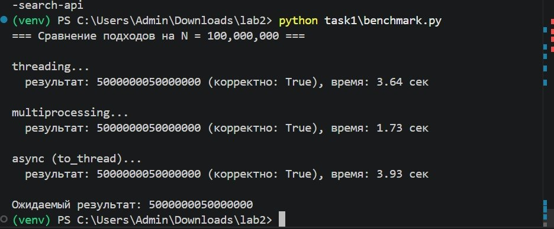
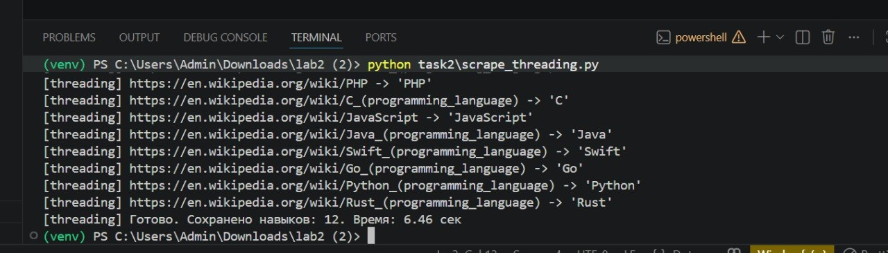
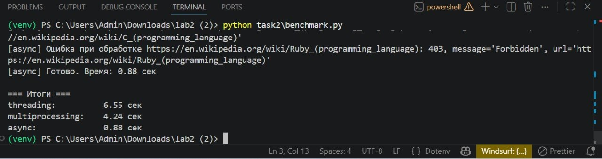
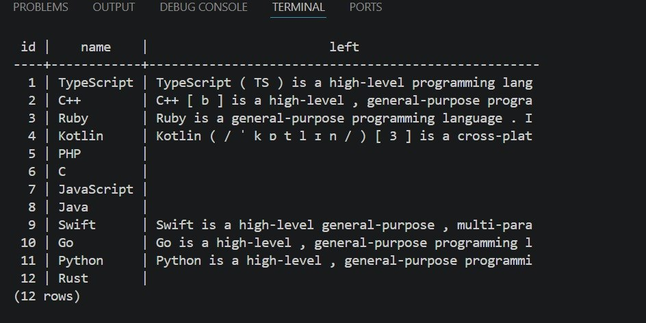

# Скриншоты

Иллюстрации работы программ.

## Задача 1 — Сумма от 1 до 10¹³

### Запуск `task1/benchmark.py`

Сравнение трёх подходов на одинаковом N. Multiprocessing — в ~2 раза
быстрее, threading и async проигрывают из-за GIL.

## Задача 2 — Параллельный парсинг

### Запуск `task2/scrape_threading.py`

Парсинг 12 страниц Wikipedia в потоках. Все 12 навыков сохранены в БД.

### Сравнение всех трёх подходов (`task2/benchmark.py`)

Async выиграл почти в 8 раз — идеальный результат для I/O-bound нагрузки.

### Содержимое таблицы `skills` в БД

12 записей с навыками — заголовки и описания со страниц Wikipedia.

