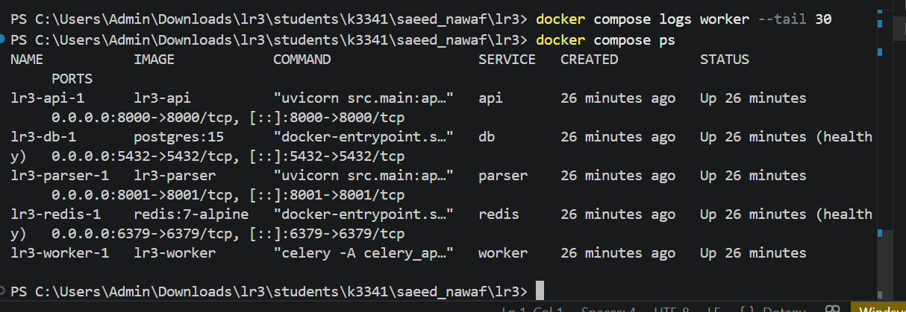
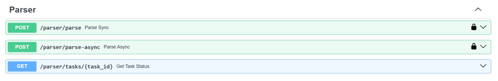
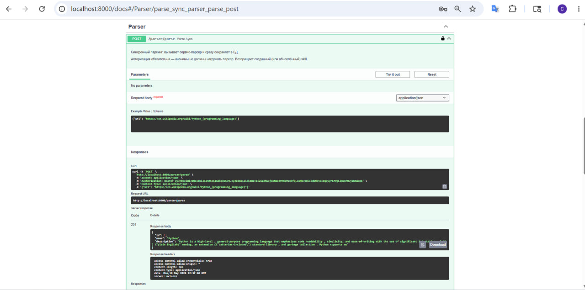
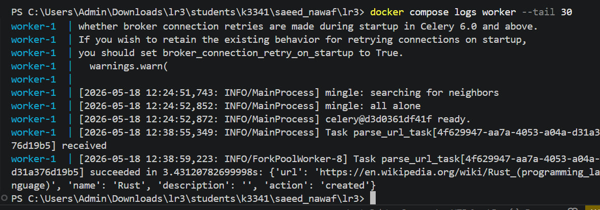
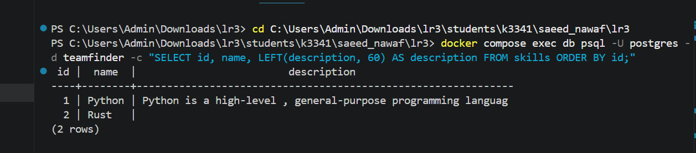

# Скриншоты

Иллюстрации работы системы.

## Запущенные сервисы

docker compose ps — пять сервисов в статусе running.

## Swagger UI основного API

http://localhost:8000/docs — видны все группы эндпоинтов,
включая раздел Parser с тремя маршрутами.

## Синхронный парсинг

POST /parser/parse через Swagger UI или curl. В ответе видно
созданный skill.

## Логи воркера

docker compose logs -f worker — Celery принимает и завершает задачу.

## Содержимое таблицы skills

\`\`\`bash
docker compose exec db psql -U postgres -d teamfinder \
  -c "SELECT id, name, LEFT(description, 60) || '...' AS description FROM skills ORDER BY id;"
\`\`\`

Записи появились после успешного парсинга.

